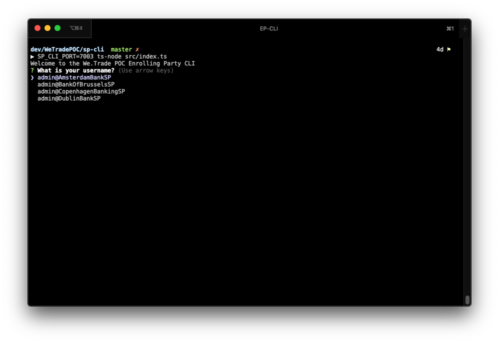
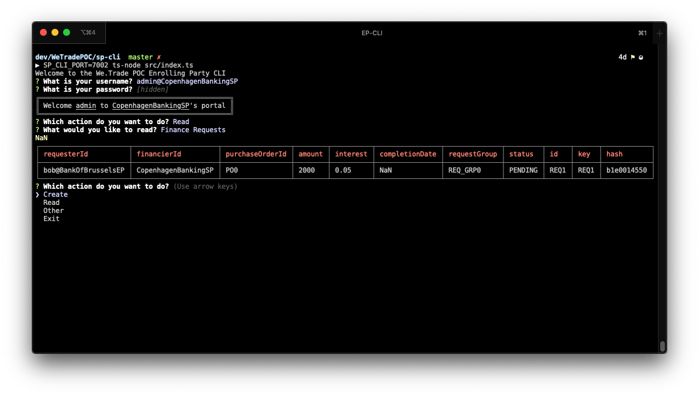
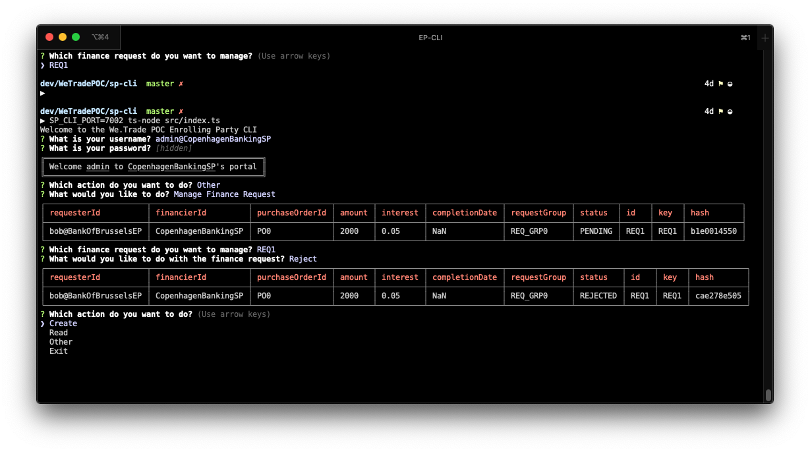

# The Service Providers CLI

## Configuration

The Command Line Interface (CLI) for this POC is written in Node.js using Inquirer and Commander. The API's work by calling a rest server that runs locally on a port specified by the `SP_CLI_PORT` environment variable.

``` bash
SP_CLI_PORT=7002 npm start
```

## Install

Build the JavaScript from Typescript.

```bash
npm build
```

Start the program

```bash
SP_CLI_PORT=7002 npm start
```

## Usage

```bash
# Create a CLI for Copenhagen Banking, who's REST server is running on port 7002
SP_CLI_PORT=7002 npm start
```

Select which participant you want to be, ensuring that the Organization name is the same as that of the REST server at the port you have chosen.


From here you can select `Create`, `Read` or `Other`

> All hashes displayed in the UI are truncated.

### Read

This allows you to view `FinanceRequests` as they appear in in the organizations Private Data Collection (PDC).



### Other

This allows you to manage your `Finance Requests`

> Here the finance request was rejected, revealing the change in status in `CopenhagenBankingSP`s PDC.



### Help

Contact [Liam Grace](mailto:liam.grace@ibm.com) or [Andrew Hurt](mailto:andrew.hurt@uk.ibm.com) if you have any issues.
